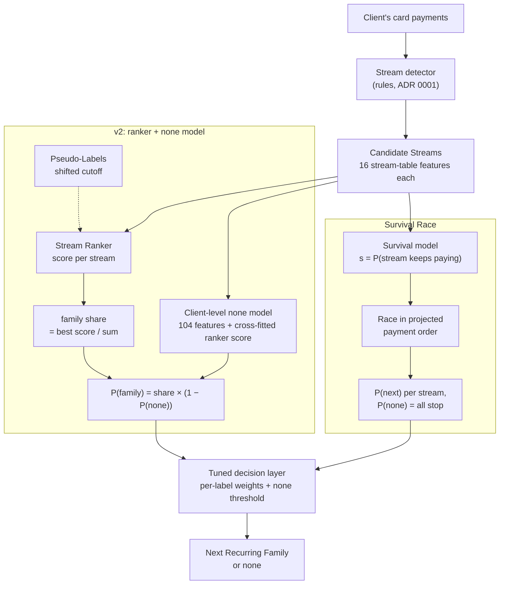

# Solution: Next Recurring Family

Our entry for the 2026 challenge (`hackathons/2026/challenge.md`). Glossary: `CONTEXT.md`. Decisions: `docs/adr/`. The organisers' `README.md` and `hackathons/` are never edited.

## Approach in brief

1. **Recurring Streams first.** A rule-based detector (`streams.py`) turns each Client's card payments into Recurring Streams. For each stream it records the Merchant Family, period, amount, payment count, last payment and projected next payment. Decoy Transactions drift sharply between splits: 0.16 per Client in train, 3.1 in valid and 4.5 in test. So every model feature comes from detected streams, never from raw transaction counts (ADR 0001).
2. **Stream Ranker.** Every stream is a Candidate Stream, and a LightGBM binary model scores how likely it is to carry the Client's Next Recurring Family. Each family takes its best candidate's score.
3. **Pseudo-Labels.** Clients from the unlabelled and train splits are labelled from their own later payments at a Shifted Cutoff (2025-10-03), and they join the ranker's training rows at half weight.
4. **Client-level `none` model.** About 30% of Clients are `none`, and most of them still have a live stream. Whether a Client is `none` depends on the Client, not on one stream's timing. So a second LightGBM model predicts `none` per Client from stream and member-payment features.
5. **Decision layer.** Per-label weights and a `none` threshold, fitted on out-of-fold probabilities, tune the decision for macro-F1.
6. **Survival Race (the second candidate).** One model replaces steps 2–4. Each Candidate Stream gets a probability of surviving the Cutoff, and the streams race in projected payment order: the label is the first survivor, or `none` if none survives. Streams behind the label's stream are censored in training. It uses the ranker's stream features only: no Pseudo-Labels and no `none` model. Architecture and trade-offs: ADR 0002.

Both candidates start from the same Candidate Streams (race and censoring diagrams: ADR 0002):



## How we evaluated

- **Our split of the labelled valid Clients:** a 700-Client selection set, used for every decision, and a 300-Client sealed holdout that no agent or script reads. Only a human can start the holdout check, once, for the finalist.
- **Every change is logged in `experiments/log.csv`:** its selection macro-F1 plus a paired bootstrap against the previous best, with the predictions committed under `experiments/runs/`.
- **What counts as a tie:** a delta under 0.03 macro-F1. That is a little more than the half-width of the paired 95% bootstrap interval, about 0.025 on 700 Clients.
- **Where choices are made:** hyperparameters, feature sets and decision layers are chosen on train out-of-fold only.

## Results on the selection set (700 Clients)

| Run | Model | Macro-F1 | vs previous best |
|---|---|---|---|
| `134044-2e6cd3` | all `none` | 0.057 | – |
| `143300-7c79fe` | LightGBM on per-Client stream features (E2) | 0.472 | improvement |
| `151636-c6fcf8` | rule: the soonest Active Stream (E1) | 0.537 | improvement |
| `151704-615cf5` | rule + `none`-gate (milestone 2) | 0.549 | tie |
| `154434-ee87f3` | Stream Ranker, tuned decision | 0.571 | improvement |
| `171108-3251a4` | + Pseudo-Labels (Day-2 12:00 upload) | 0.574 | tie |
| `195225-27531a` | blend of the rule and the ranker | 0.573 | tie |
| `215400-3a4f12` | + Pseudo-Labels with churn (fidelity check passes) | 0.567 | tie |
| `225229-cc7243` | + Client-level `none` model | 0.576 | tie |
| `001614-c904bc` | ranker + Pseudo-Labels, Stray Payments join streams (ticket 11) | 0.577 | tie |
| `001755-e309a3` | ranker + `none` model + Pseudo-Labels, Stray Payments join streams (ticket 11) | 0.587 | tie |
| `014822-cd37c4` | as above, and Decoy-described payments also join (ticket 12, off by default) | 0.588 | tie |
| `080905-fd1dc5` | **Survival Race** (ticket 13, ADR 0002) | **0.590** | tie |
| `085645-c70788` | Survival Race, monthly-slot order for single-payment streams | 0.586 | tie |
| `102231-5456a7` | **Survival Race, soft race order** (ticket 14): the race averaged over uncertain payment dates | **0.599** | tie |

**Beyond the selection set** (v2 = `001755-e309a3` refit on train plus the selection set):

| Candidate | Sealed holdout (300 Clients, one human-started check) | Test leaderboard |
|---|---|---|
| v2: ranker + `none` model + Pseudo-Labels | 0.596 | **0.606** |
| Survival Race | – | 0.594 |
| Survival Race, soft race order (`submissions/day2_final_survival_soft.csv`) | – | – |

v2 held up on test, and the drift we feared did not cost it. The Survival Race scored 0.594 on test: 0.012 below v2. That reverses its +0.003 on selection, and both gaps are inside the noise of 700 and 1,000 Clients. The two candidates disagree on 16% of test Clients. Only the best upload counts, so both were uploaded.

## What we learned

- **Where it is timing jitter, average over it.** A stream's real next payment misses its projection by 3.6 days typically (leave-last-out on 27,101 train and unlabeled streams), so when two streams are projected within a few days a fixed race order is a guess. The soft race (ticket 14) jitters each stream's date by its own spread and averages the Survival Race exactly over every order. P(`none`) cannot change (it is Π (1 − s) whatever the order), so only the split among detected families moves: on train out-of-fold it fixes 24 of the 75 close-call Clients and breaks none, +0.006 nested tuned; on selection 0.599 against 0.590 for the hard race (a tie). Weighting the fit's rows by the same uncertainty lost (−0.010): a target-0 row for a stream due after the label's stream teaches "stopped" to streams that were most likely alive.
- **Choosing among live streams is not timing jitter: streams stop.** Ticket 06 found the soonest projected payment right only 60% of the time among several live streams. On the selection set this is v2's largest loss (111 Clients, worth +0.19 if fixed), and the true stream is projected a median of 7 days later: too far for jitter. The train labels fit each Active Stream independently surviving the Cutoff (about 50%), with the label the soonest survivor. With 3 active families that predicts none / 1st / 2nd = 0.125 / 0.50 / 0.25 against 0.128 / 0.48 / 0.22 observed. Survival is predictable (AUC 0.86), which gave us the Survival Race (ADR 0002). It was +0.016 over v2 on train but only +0.003 on selection (a tie). Its biggest gains are on mobile (0.52 → 0.70) and insurance (0.55 → 0.61).
- **The description route to `none` is closed (ticket 16).** When another team reached 0.68 on test, we probed for a `none` signal our stream features miss. The files leak nothing (Client id, file order, timestamps). Raw description features lift the `none` AUC on train from 0.89 to 0.94, all through the Filler Descriptions "member plan", "digital service" and "subscription charge": in train they sit on 45–50% of `none` Clients and 8% of family Clients, and two of them make a Client 91% `none`. But valid and test spray the same descriptions over 65–77% of Clients' real streams, the raw features separate train from test with AUC 1.0, and even learned on valid-like data (cross-validation over train plus the selection set) they add at most +0.01 to +0.02: a tie. Whatever gets to 0.68 is not in the descriptions.
- **`none` is the main lever.** Setting every live-stream truth-`none` Client to `none` would lift train macro-F1 from 0.58 to 0.69. Classic churn signals (an overdue stream, a missed or late last payment, a final refund) are near chance. A Client-level model on per-Client stream aggregates lifts the `none` AUC from 0.69 to 0.88 (`experiments/analysis/churn/`).
- **Pseudo-Labels can't teach `none`.** Inside the history only 3–5% of live streams stop within 90 days, but at the real Cutoff 23% of live-stream Clients are `none`. A Pseudo-Labeller with uniform churn passes the fidelity check, but it is label noise, not signal (ticket 08).
- **Train gains shrink on valid and test because the stream features drift.** Filler Descriptions are far more common in valid and test, and they break streams apart. `max_missed_rate` averages 0.07 in train, 0.13 in valid and 0.17 in test. The `none` model's +0.040 on train became +0.003 on selection. Most missing payments are Filler Descriptions booked on another family's home MCC, and in train they mark `none` Clients (92.5% of train Clients with such a payment on a stream's schedule are `none`). So the `none` model learned an artefact of train. Ticket 11 lets these Stray Payments join a stream on its schedule. That cuts the train-vs-test classifier AUC on the `none` model's features from 0.81 to 0.73, and `max_missed_rate` in test from 0.167 to 0.089. The ranker with the `none` model then scores 0.587 on selection, the best so far (+0.011 over the old detector: a tie).
- **Decoy-described stream payments stay out.** Valid and test also carry some stream payments with a Decoy description: 8.6 per 100 valid streams fill a gap on the schedule, against a control of 0.9. Letting them join (ticket 12) narrows the shift a little more, but it only ties on selection (+0.001) and costs 0.008 on train. In test about 1 in 5 of those joins would be a real Decoy Transaction. So `join_decoys` exists but is off by default (ADR 0001).
- **Settled on train and left alone:** averaging over seeds adds nothing. A larger ranker (31 leaves, 600 trees) gains on train alone but not once the `none` model is in. The tuned decision layer is worth about +0.014 when fitted and scored on different folds, half its apparent in-sample gain.

## Setup

```sh
uv sync
uv run rf fetch-data          # unpacks hackathons/2026/data/dataset.zip into data/raw/ (idempotent)
```

## Pipeline

```sh
uv run rf train --model prior
uv run rf evaluate --model prior --change "what changed" --conclusion "what we learned"
uv run rf submit --model prior --name milestone1-all-none
uv run rf submit --check submissions/milestone1-all-none.csv
```

The milestone-2 submission is the gated rule, reproduced exactly by (`join_strays=false`: the stream detector before ticket 11, which lets stray Filler Description payments join a stream on schedule):

```sh
uv run rf train --model rules --none-gate --param join_strays=false
uv run rf submit --model rules --name milestone2_rules_none_gate_v2
```

For the Day-2 12:00 milestone, `rf compare` found a three-way tie between the rule, the ranker and the ranker with Pseudo-Labels on the selection set (`bash scripts/day2_noon_milestone.sh`, `submissions/day2_noon_rules_gate4.md`; it refits the rule with `--param join_strays=false`, the detector it was made with). That rule's test predictions are the milestone-2 file, and the final rank takes the best of all milestones. So the upload is the highest-scoring candidate instead, the ranker with Pseudo-Labels, refit on train plus the selection set: `bash scripts/day2_noon_ranker_pseudo.sh` writes `submissions/day2_noon_ranker_pseudo.csv`. It reproduces that file byte for byte at commit `82f79d3`. Ticket 11's detector gives a slightly different file (92% agreement), and the ranker takes no `--param`.

- `streams --split valid` detects (or loads cached) Recurring Streams and prints a per-family summary. `--param NAME=VALUE` (repeatable) overrides one stream detection parameter, e.g. `--param amount_tolerance=0.08`. Each parameter set is cached separately under `artifacts/streams/`, and a change to the detector code, family table or raw data rebuilds.
- `pseudo-labels --split <split> --cutoff <date>` writes each Client's Pseudo-Label at a Shifted Cutoff (default 2025-10-03, the latest whose 90-day Horizon is fully observed) to `artifacts/pseudo_labels/<split>-<cutoff>-min<N>.csv` (`client_id, cutoff_date, target_next_recurring_merchant`, like a label file) and prints the per-label counts and shares. It works for every split, valid and test included, because it reads transactions only: any label read while it runs is refused. `--min-payments N` is the payments a Recurring Stream needs for its Horizon payment to count (default 4, chosen by the fidelity check); `--param NAME=VALUE` overrides the labeller's stream detection. Tables are cached under `artifacts/pseudo_labels/cache/` by split, Shifted Cutoff, detector version and labeller parameters.
- `pseudo-labels --split train --fidelity` is the fidelity check: for each `min_payments` in `--candidates` (default 2-10) it compares the Pseudo-Label `none` share with the real train share, and the milestone-2 rule's macro-F1 against Pseudo-Labels (its inputs are the transactions before the Shifted Cutoff only) with its macro-F1 against the real labels. It chooses the setting with the smallest worse gap relative to the tolerances (0.05 each), prints PASS or FAIL, writes that setting's table and appends a `fidelity` row to the log. On the real train split it fails (the `fidelity` row of 2026-09-24).
- `train --model rules` is E1, the rule baseline: among each Client's Active Streams whose projected next payment falls within the Horizon, it predicts the family of the one due soonest, else `none`. `--none-gate [N]` adds the milestone-2 `none`-gate: a Client whose longest surviving stream has at most N payments (default 4) gets `none`; it is off unless given. `--ordering most_recent|longest` picks by another rule, and `--param NAME=VALUE` overrides stream detection parameters; all are saved with the model, and the log's model column names the variant (`rules+gate4`).
- `train --model lgbm` fits E2: LightGBM multiclass (balanced class weights, default hyperparameters) on one feature row per Client, built only from its Recurring Streams (ADR 0001): the top three Active Stream slots, a block per Merchant Family and the `none` signals. `features --split test` writes the rows the trained model scores for a split (same columns for every split); for the Clients it was fitted on (train, plus the selection set after `--with-selection`) those are the out-of-fold rows it trained on, so no row carries its own Client's label. `cv --model lgbm` saves its out-of-fold probabilities.
- `train --model ranker` fits the Stream Ranker: every detected Recurring Stream is a Candidate Stream, and a LightGBM binary model scores whether it carries the Client's Next Recurring Family, from stream-table features only (ADR 0001). Each family takes its best candidate's score, `none` is one minus the best score, and the row is normalised; a Client without streams is `none`. It works with `cv`, `evaluate`, `submit` and `--decision tuned` like any model.
- `train` and `cv --model ranker --pseudo SPLIT[:YYYY-MM-DD]` (repeatable) also fit on a split's Clients Pseudo-Labelled at a Shifted Cutoff (default 2025-10-03). Their Candidate Streams come from their transactions before it and their labels from `pseudo-labels`, so no label file is read and any split may be a source; a train Client may appear with its real label and as a Pseudo-Labelled Client. `--pseudo-weight W` (default 0.5) is their sample weight (real-labelled Clients weigh 1) and `--pseudo-min-payments N` (default 4) the labeller's setting. Pseudo-Labelled Clients join every fold's fit but are never scored, so the out-of-fold rows and the tuned decision layer are real-labelled only. The model metadata and the `evaluate` log row (`training_clients`, `pseudo_sources`, `pseudo_weight`, `pseudo_min_payments`, `fidelity`) record what it was trained on; `fidelity` is the latest fidelity check's verdict and run (`fail ...` today), or `unchecked`. Training still runs when that check failed; the model column reads `ranker+pseudo`.
- `train --model blend` mixes the gated rule and the Stream Ranker as `rule_weight * rule + (1 - rule_weight) * ranker` (`--rule-weight W`, default 0.5). The rule inside it takes `--none-gate`, `--ordering` and `--param`, and the ranker takes `--pseudo`, in `train` and `cv` alike. The saved blend is `artifacts/blend.json` plus its parts beside it (`blend.rules.json`, `blend.ranker.json`). `scripts/blend_weight_sweep.py` chooses the weight on train out-of-fold probabilities only (`experiments/blend_weight_sweep.csv`: 0.1 is best, +0.002 over the ranker alone). On the selection set the chosen blend scores 0.5726, a tie with the ranker with Pseudo-Labels (0.5735), so the blend is kept as a logged comparison only.
- `train` and `cv --model ranker --none-model` add a Client-level `none` model: a LightGBM binary model fitted on the real-labelled Clients with Candidate Streams (never on Pseudo-Labelled ones) gives P(`none`), and each family keeps its share of the ranker's family scores. Its features come from the stream table and the member payments and matched refunds of detected streams (ADR 0001), plus the ranker's own `none`, cross-fitted for training Clients. `scripts/none_model_variants.py` chose the feature set on train out-of-fold (`experiments/none_model_variants.csv`: nested tuned macro-F1 0.5699 -> 0.6095). On the selection set it scores 0.5764, a tie with the ranker with Pseudo-Labels; the model column reads `ranker+none+pseudo+tuned`. `scripts/day2_final_ranker_none.sh` writes the refit candidate `submissions/day2_final_ranker_none.csv`.
- `train` and `cv --model survival` fit the Survival Race (ticket 13, ADR 0002). A LightGBM binary model on the ranker's stream-table features gives each Candidate Stream a probability s of surviving the Cutoff. A Client's streams race in projected payment order: P(stream i next) = s_i × Π over earlier streams of (1 − s_j), and P(`none`) = Π (1 − s_j). It trains only on the streams up to the label's stream, with target 1 there, 0 before it and later streams censored. Clients whose label family has no Candidate Stream are left out, and the count is printed.
  - `--race-order unprojected-last|recent-first|monthly-slot` places the single-payment streams, which have no projected date; the default is `monthly-slot`. The order is saved with the model and named in the log's model column, e.g. `survival+monthly-slot+tuned`.
  - `--soft-race` (ticket 14) treats each stream's next payment date as uncertain instead of fixing the order: T_i = mu_i + sigma_i Z with mu_i its race slot and sigma_i = max(3.6, 1.4 × `gap_mad_days`) days (6.2 for a single-payment stream), calibrated on train plus unlabeled history (`experiments/analysis/survival/jitter_calibration.py`, no labels). The race is averaged exactly over every order the dates can produce (Gauss-Hermite quadrature), so P(`none`) = Π (1 − s_j) is unchanged and only the split among detected families moves. It needs `--race-order monthly-slot` (every stream has a date) and fits the same rows as the hard race: weighting them by the same uncertainty (`SurvivalModel(soft_fit=True)`, Python only) lost on train. The log's model column reads `survival+monthly-slot+soft+tuned`.
  - `--pseudo` and `--none-model` are refused.
  - `scripts/day2_final_survival.sh` refits the candidate (unprojected-last, 0.5903 on selection) on train plus the selection set and writes `submissions/day2_final_survival.csv`.
  - `scripts/day2_final_survival_soft.sh` refits the soft race (monthly-slot order, 0.5987 on selection, run `20260925T102231-5456a7`) on train plus the selection set and writes `submissions/day2_final_survival_soft.csv`, the Survival Race candidate since ticket 14; it agrees with the hard-race file on 88.6% of test Clients and with v2 on 83.5%.
- `evaluate` reports macro-F1 over the eight allowed labels and per-family F1, and appends one row to `experiments/log.csv`. For E1 the row also records coverage (how often the true family is among the surviving streams, over Clients whose label is a family) and selection accuracy given coverage.
- E3 decision layer, for any model: `train --model <m> --decision tuned` also fits one weight per label plus a `none` threshold by grid search on the training Clients' out-of-fold probabilities (never valid labels). `evaluate` and `submit` then take `--decision tuned` (default `argmax`), or `--decision <file>.json` with hand-set `weights` and `none_threshold` (`none` when P(none) >= 1 - threshold; 0 never predicts `none`, 1 always does). A tuned decision is refused on Clients it was fitted on.
- `compare --run RUN --run RUN ...` picks a milestone candidate among logged runs, simplest first: it scores each run's committed predictions on the same Clients, gives each its macro-F1 with a 95% bootstrap interval, compares every pair with the paired bootstrap (deltas under 0.03 are ties) and names the simplest candidate that no other candidate beats. `--out file.md` also writes the comparison as Markdown. It refuses sealed-holdout runs, runs on different splits and runs without saved predictions, and reads the selection labels only after every prediction is loaded.
- `submit` writes `submissions/<name>.csv` for the test Clients and refuses files with missing, extra or duplicate Client IDs or labels outside the allowed set.

## Layout

| Path | Contents | In git |
|---|---|---|
| `data/raw/`, `data/interim/` | challenge data, caches | no |
| `artifacts/` | fitted models | no |
| `submissions/` | submission CSVs | yes |
| `experiments/log.csv` | experiment log | yes |

## Tests

```sh
uv run pytest                 # fast suite, fixture data only
uv run pytest -m slow         # real-data checks (needs fetch-data)
```
