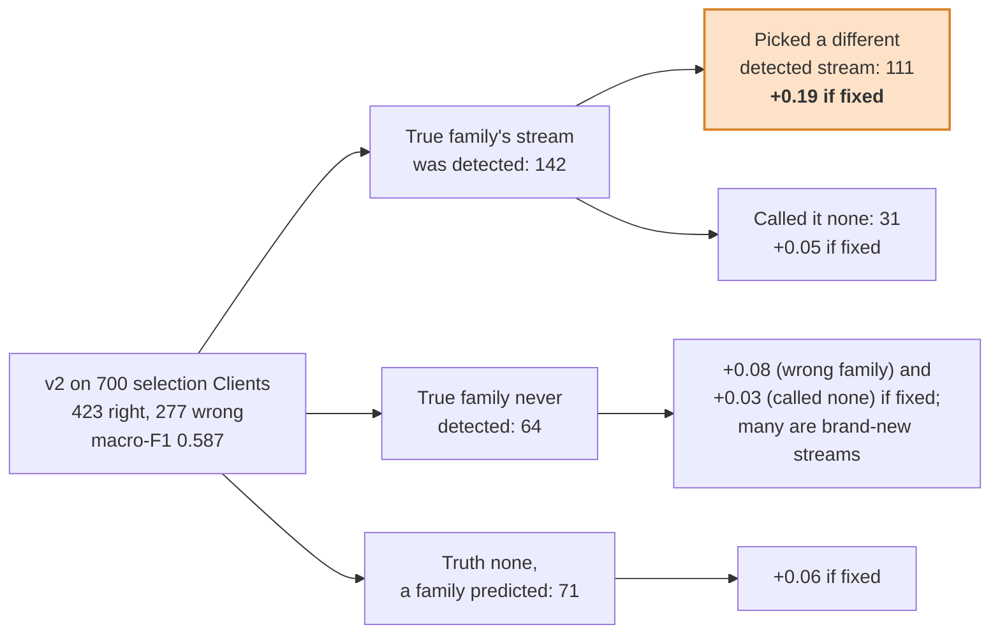
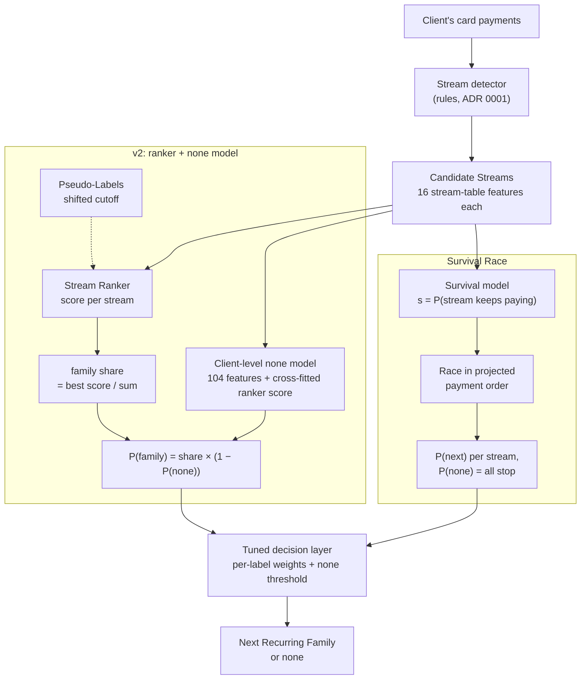

# The Survival Race: one model for `none` and the family

Ticket 13. It is added beside the Stream Ranker, and it does not replace it.

## Context

The Stream Ranker scores each Candidate Stream on its own, and a separate Client-level model predicts `none`. We broke down where the best such model (v2, run `20260925T001755-e309a3`, 0.5871 on selection) loses macro-F1 on the selection set. Fixing each bucket of errors in turn would gain:



The largest loss is choosing among streams we *did* detect. In 84 of the 111 Clients, v2 picked the stream projected to pay first. The true stream was projected a median of 7 days later, which is too far to be schedule jitter on monthly streams.

On train, the labels fit a simple process. Each Active Stream independently survives the Cutoff with probability about 0.5. The label is the soonest survivor, or `none` if no stream survives.

| Active families | Clients | Predicted none / 1st / 2nd | Observed none / 1st / 2nd |
|---|---|---|---|
| 3 | 305 | 0.125 / 0.50 / 0.25 | 0.128 / 0.48 / 0.22 |
| 4 | 78 | 0.06 / 0.50 / 0.25 | 0.064 / 0.46 / 0.19 |

The scripts are in `experiments/analysis/survival/`. This is a pattern found in train labels, the kind a subscription-churn analyst would look for. We did not reverse-engineer the data generator: that was ruled out as against the spirit of the challenge.

## Decision

`--model survival` (`src/recurring_family/survival.py`) models that process directly. It sits beside v2 and starts from the same Candidate Streams:



- **The survival model.** A LightGBM binary model gives every Candidate Stream a survival probability s. Its features are the ranker's 16 stream-table features and nothing else (ADR 0001).
- **The race.** Each Client's streams are ordered by projected next payment. With the order fixed:
  - P(stream i is next) = s_i × Π_{j before i} (1 − s_j)
  - P(`none`) = Π_j (1 − s_j)
  - A family's probability is the sum over its streams. A Client with no Candidate Stream is `none`.

  A worked example: one Client, three streams, each asked in turn whether it keeps paying. The four outcomes sum to 1.

  ```mermaid
  flowchart LR
      G{"gym<br/>due in 4 days<br/>keeps paying?<br/>s = 0.6"} -- "yes 0.6" --> PG["<b>gym</b><br/>0.60"]
      G -- "no 0.4" --> Mu{"music<br/>due in 12 days<br/>s = 0.5"}
      Mu -- "yes 0.5" --> PM["<b>music</b><br/>0.4 × 0.5 = 0.20"]
      Mu -- "no 0.5" --> Cl{"cloud<br/>due in 20 days<br/>s = 0.3"}
      Cl -- "yes 0.3" --> PC["<b>cloud</b><br/>0.4 × 0.5 × 0.3 = 0.06"]
      Cl -- "no 0.7" --> PN["<b>none</b><br/>0.4 × 0.5 × 0.7 = 0.14"]
  ```
- **Training.** One Client's log-likelihood splits into plain binary rows:
  - the label's stream gets target 1;
  - every stream ordered before it gets target 0;
  - streams after it are **censored** and get no row, because nobody saw whether they would have paid;
  - a `none` Client gives every stream target 0.

  ```mermaid
  flowchart LR
      subgraph L["Client labelled music: streams in race order"]
          direction LR
          A["gym<br/>due in 4 days"] --> B["music<br/>due in 12 days"] --> C["cloud<br/>due in 20 days"]
      end
      A -.- RA["row, target 0<br/>due first, but it stopped"]
      B -.- RB["row, target 1<br/>it paid: the label"]
      C -.- RC["no row: censored<br/>nobody saw whether it would pay"]
      style RA fill:#f8d7da,stroke:#c0392b
      style RB fill:#d4edda,stroke:#2e7d32
      style RC fill:#eeeeee,stroke:#999999,stroke-dasharray: 4 3
  ```

  So the fit is an ordinary LightGBM fit on a filtered set of rows: 3,913 of the 6,507 train candidates. The Stream Ranker, in these terms, trains those later streams as negatives.
- **Decision layer.** The same tuned per-label weights and `none` threshold as every other model.
- **What was left out.** No Pseudo-Labels, no Client-level `none` model and no churn features.

## Results

| | Train out-of-fold, nested tuned | Selection (700) | Test (leaderboard) |
|---|---|---|---|
| v2: ranker + `none` model + Pseudo-Labels | 0.6082 | 0.5871 | **0.6059** |
| Survival Race (unprojected-last order) | 0.6239 | **0.5903** | 0.5937 |
| Survival Race (monthly-slot order) | 0.6323 | 0.5862 | – |
| Survival Race, soft race order (ticket 14, the amendment below) | 0.6387 | 0.5987 | – |

v2 also scored 0.5960 on the sealed holdout.

Every difference in the table is a tie under our rule (a delta under 0.03). On test, the Survival Race scored 0.012 below v2, the opposite sign to selection. With 1,000 test Clients that is noise too. The Survival Race agrees with v2 on 83% of selection Clients and 84% of test Clients.

It gains most where v2 was weakest: mobile F1 rises from 0.52 to 0.70 and insurance from 0.55 to 0.61. It is lower on cloud and software. The probabilities are calibrated. The predicted `none` rate matches the observed rate for Clients with 1, 2 and 3 active families (0.35/0.32, 0.23/0.22, 0.14/0.13). With 4 families it overpredicts: 0.11 against 0.06.

## Trade-offs

**One model, not two.**
- For: a Client's family and `none` probabilities come from one process, so they are consistent by construction. We need no cross-fitting of one model's score into another, and have fewer moving parts.
- Against: it assumes streams survive independently once their features are known. The 4-family overprediction suggests survival is correlated within a Client: Clients who cancel tend to cancel several subscriptions. A Client-level frailty term would model that. It is not built.

**Censoring instead of negatives.**
- For: it is the right likelihood. A stream behind the label's stream is not evidence of a stop.
- Against: it trains on 40% fewer rows than the ranker.

**Unexplained Clients are dropped.** 87 train Clients (4%) have a label family that is not among their Candidate Streams: a brand-new or undetected stream.
- For: their race order is unknown, so they can't give honest rows.
- Against: the model gives such families zero probability. About 6% of labels are families never seen in the history, and no stream-based model can predict them.

**Ranker features only.**
- For: adding the churn features (member-payment gaps, refunds, Client churn history) raised the survival model's AUC from 0.86 to 0.88 but lowered nested macro-F1 (0.6171 against 0.6239). Those are also the features that drift between train and test (ticket 09's review). The 16 ranker features are the most drift-robust set we have.
- Against: some real churn signal is left unused.

**No Pseudo-Labels.**
- For: at a Shifted Cutoff almost no stream stops (ticket 08), so Pseudo-Labels would teach s ≈ 1.
- Against: less training data than the ranker gets.

**A hard race order.**
- For: it is simple and exact given the order.
- Against: projected dates have jitter, so a soft race that integrates over each stream's schedule uncertainty would be more faithful. Built as `--soft-race` (ticket 14); see the amendment below.

**Single-payment streams have no projected date.**
- The default is monthly-slot: last payment + 30.4 days, rolled forward past the Cutoff, used only to place the stream in the order. It is best on train (nested +0.008, a tie).
- The submitted candidate uses the original order, unprojected-last: these streams race last, in stream-table order. It is best on selection (+0.004, a tie). We fixed the rule before running selection, and by that rule the submitted file stayed.
- `scripts/day2_final_survival.sh` pins `--race-order unprojected-last`, and every run records its order in the log's model column (`survival` or `survival+monthly-slot`).

**Train gains shrink on selection, again.**
- The +0.016 over v2 on train became +0.003 on selection. That is the same pattern as the `none` model's, and it matches the drift between train and valid/test.
- The Survival Race needs fewer parts and fewer drifting features, yet only ties v2. So the two are uploaded as distinct candidates, not one replacing the other.

## Consequences

- **Its own model.** The Survival Race lives beside the Stream Ranker as `--model survival`, and the ranker's code and outputs are unchanged. Tests pin the building of the training rows, the race's closed form, every race order through fit and predict, the label guards and Decoy injection.
- **Candidates.** `submissions/day2_final_ranker_none_v2.csv` (v2) and `submissions/day2_final_survival.csv` (Survival Race) are the two candidates. Only the best upload counts, and they disagree on 16% of test Clients. Since ticket 14 the Survival Race candidate is `submissions/day2_final_survival_soft.csv` (the soft race order; it agrees with the hard-race file on 88.6% of test Clients).
- **Open follow-ups:**
  - a Client-level frailty term;
  - ~~a soft race order~~ (ticket 14, the amendment below);
  - overdue streams that may pay late rather than a period later (ticket 15);
  - an average of v2's and the Survival Race's probabilities;
  - Pseudo-Labels with an `is_pseudo` feature (ticket 13, variant 3, not run).

## Amendment (ticket 14): the soft race order

**Context.** The race order was fixed from projected dates. On the selection set, the true and the picked stream were projected within 3 days of each other in 23 of the 111 wrong-stream Clients. A leave-last-out calibration on train plus unlabeled history (27,101 streams, no labels) shows a stream's real next payment misses its projection by 3.6 days typically, flat until the stream's own schedule MAD passes about 2.6 days and then about 1.4 × MAD; a single-payment stream's monthly slot misses by 6.2 days. So a 3-day gap between two projections is close to a coin toss, and even a 7-day gap (the median in the 111) leaves the later stream a 1-in-6 chance of paying first.

**Decision.** `--soft-race` treats each stream's date as T_i = mu_i + sigma_i Z (normal; mu_i the monthly-slot race slot, sigma_i = max(3.6, 1.4 × `gap_mad_days`), 6.2 for a single-payment stream) and averages the race over every order the dates can produce. With independent dates that is exact and one-dimensional per stream:

- P(stream i is next) = s_i ∫ f_i(t) Π_{j≠i} (1 − s_j F_j(t)) dt, by Gauss-Hermite quadrature (48 nodes);
- P(`none`) = Π_j (1 − s_j), exactly as in the hard race: **no order, soft or hard, changes a Client's `none` probability**. The soft race only moves mass among detected families, so it cannot touch the `none` buckets of the loss breakdown, only the wrong-stream bucket.

The survival model's fit is unchanged (the hard race's rows). The constants are calibrated on transactions, never tuned on labels.

**Results (train 5-fold out-of-fold, nested tuned macro-F1).**

| | nested tuned | vs the hard monthly-slot race |
|---|---|---|
| Hard race, `unprojected-last` (the committed candidate) | 0.6239 | −0.0084 |
| Hard race, `monthly-slot` | 0.6323 | |
| **Soft race over the same fit** | **0.6387** | **+0.0064** (95% −0.007 .. +0.019) |
| Soft race over a soft-weighted fit | 0.6227 | −0.0097 |

Among the 75 train Clients where the hard race picked the wrong stream within 3 days of the true one, the soft race fixes 24 and breaks none (argmax); its 39 fixes and 38 breaks overall net to the nested gain through the decision layer (76 fixed, 60 broken). On the selection set (run `20260925T102231-5456a7`) it scores **0.5987** against 0.5903 for the committed hard-race candidate: +0.0084 (95% −0.016 .. +0.034), a tie, and above the bar fixed before the run, so `submissions/day2_final_survival_soft.csv` (`scripts/day2_final_survival_soft.sh`) replaces `day2_final_survival.csv` as the Survival Race candidate. Mobile (0.70 → 0.73), cloud (0.57 → 0.60) and `none` (0.67 → 0.69) gain; music (0.51 → 0.46) loses.

**Trade-offs.**
- For: it is the more faithful likelihood for exactly the Clients where a hard order is guesswork; deterministic; a few milliseconds per Client; P(`none`) is provably unchanged, so the model's calibration on `none` carries over.
- Against: the gain is bounded by the close calls (about 30 flippable Clients in 2,000 on train), so it reads as a tie on 700 selection Clients whatever it does. It assumes independent normal dates; the calibration's tails are heavier than normal (excess kurtosis 7.6), which the core-based sigma ignores. Overdue-and-rolled streams (9.9% of Active Streams) still race a full period out (ticket 15).
- **Weighting the fit's rows by the same uncertainty lost** (−0.0097 nested): a target-0 row at weight P(T_j < T_m) for a stream due after the label's stream teaches "stopped" to streams that were most likely alive. It stays reachable as `SurvivalModel(soft_fit=True)` from Python, with no CLI flag.
